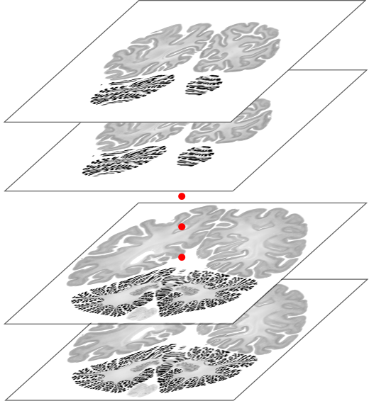

# Image registration using SIFT descriptors

The goal of this project, is to investigate and better understand image registration. For this purpose, batch of unregistered brain images is used as a data set. In the end I want to have an aligned version of each image to enable downstream tasks like 3D reconstruction.

